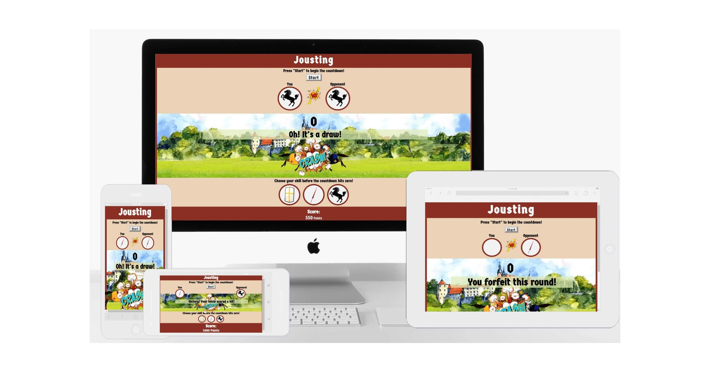
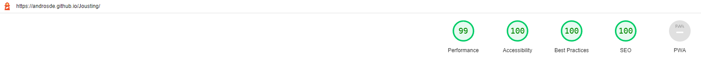

<h1 align="center"> Jousting </h1>
<h2> Welcome </h2>

<h3> 
  This is the JavaScript-based game: "Jousting".<br>The user has to select one of three Jousting-Skills within 5 seconds, before the knights' clash. The opponent will create his skills randomly.<br>Depending on the outcome different amount of points will be rewarded.
<h3>

<h2 align="center"></h2>

[View the live project here](https://androsde.github.io/Jousting/)

<hr>

<h2> Table of content </h2>

- ### [User Experience (UX)](#user-experience-ux-1)
  - [Customer Focus](#customer-focus)
  - [Design](#design)
  - [Wireframe](#wireframe)
- ### [Features](#features-1)
  - [Existing Features](#existing-features)
  - [Features Left to Implement](#features-left-to-implement)
- ### [Technologies Used](#technologies-used-1)
  - [Languages Used](#languages-used)
  - [Frameworks, Libraries & Programs Used](#frameworks-libraries--programs-used)
- ### [Testing](#testing-1)
  - [Testing the User Experience (UX)](#user-experience-ux)
  - [Further Testing](#further-testing)
- ### [Deployment](#deployment-1)
  - [GitHub Pages](#github-pages)
  - [Forking the GitHub Repository](#forking-the-github-repository)
  - [Making a Local Clone](#making-a-local-clone)
- ### [Credits](#credits-1)
  - [Code](#code)
  - [Content](#content)
  - [Media](#media)
  - [Acknowledgements](#acknowledgements)


<hr>

## User Experience (UX) 

- ### Customer Focus
  1. The player needs to be able to easily navigate the site to find the game controls and buttons.
  2. The player needs to be able to easily find the information about the remaining time after pressing start.
  3. The visitor needs to be shown a clear message about the outcome.
  4. The visitor needs to be able to see the points scored.

- ### Design
  - #### Color Scheme
    - The color scheme is based on the painting of "Tjost" by Jörg Breu the Younger for Paulus Hector Mair
      <h3></h3>

  - #### Typography
    - The 'Germania One' set up the tone of old german / old English
    - As only a few instructions are given and the font is readable and clean, only this font is used on the site

  - #### Imagery
    - Imagery is important, hence there is the main stage on which animated pictures will underline the countdown, making the game more interactive
    - the skills are displayed by pictures to make it clearer and easier to use

- ### Wireframe
  - Main Page Wireframe - [View](/workspace/Jousting/assets/jousting.bmpr)

<hr>

## Features
- ### Existing Features
  - #### Heading
    - The heading displays the clear title of the game.

      <h3></h3>

  - #### Help-Button
    - Information about how to play the game, the game rules, and how the points are awarded can be found here.

      <h3></h3>
  
  - #### "Reset Score"-Button
    - If a player wishes to reset the score back to "0", it can be done in two ways:
    1. Refresh the website.
    2. Use the "Reset Score"-Button and confirm the pop-up window.
        <h3></h3>

  - #### Game Starter
    - The start button is central in the upper section of the page.
    - A message above the start button provides clear instructions.
    - Pressing the start button will call upon the JavaScript functions.

      <h3></h3>

  - #### Selected Skill Section
    - The skills that have been chosen by the player and the JavaScript-generated skills are displayed here to visually confirm and display the skills that are compared for the current round.

      <h3></h3>

  - #### Animation
    - An animation of two knights clashing will be displayed to underline the countdown.

      <h3></h3>
  
  - #### Countdown
    - Counting down for 5 seconds from "4" to "0".
    - When the countdown is at "0" a message about the result will be displayed.

      <h3></h3>

  - #### Message
    - A clear and roleplay-appropriate message displays the result of the tjost.
    - Depending on the skills used and if it has been a won, draw, lost, or forfeit round will change the message.

      <h3></h3>

  - #### Skill Selection Section
    - Three buttons display the available options to the player.
    - A short explanation above the buttons.
    - A focused button will be set apart from the non-focused buttons.

      <h3></h3>

  - #### Score Section
    - The Score section will display the gained score with: 
      <br>1000 for a win.
      <br>500 for a draw.
      <br>50 for losing.
      <br> Not choosing any skill will be displayed as "forfeiting the round" and will give no points.
    
      <h3></h3>
  
  - #### Button Blocker
    - The Game Starter will be blocked once the button is clicked and unblock when the countdown is at "0".
    - likewise, the Skill Selection Section is blocked and will unblock when the game is started, it will block again when the countdown is at "0".


- ### Features Left to Implement
  - #### Login
    - A Login option to use it in combination with a database to save the game score.
  - #### Database
    - Adding a database to display and compare the score of the diffrent players.
  - #### Help-Section
    - A bigger Alert-Box for the "Help" section.
<hr>

## Technologies Used
- ### Languages Used
  -  [HTML5](https://en.wikipedia.org/wiki/HTML5)
  -  [CSS3](https://en.wikipedia.org/wiki/Cascading_Style_Sheets)
  -  [JavaScript](https://en.wikipedia.org/wiki/JavaScript)

- ### Frameworks, Libraries & Programs Used
  1. [Google Fonts:](https://fonts.google.com/) - Google fonts were used to import the "Fjalla One" and "Quicksand" font into the style.css file which is used on all pages throughout the project.
    1. [Git](https://git-scm.com/) - Git was used for version control by utilizing the [Gitpod](https://gitpod.io/) terminal to commit to Git and Push to GitHub.
  1. [GitHub:](https://github.com/) - GitHub is used to store the code of the project after being pushed from Git.
  1. [Balsamiq:](https://balsamiq.com/) - Balsamiq was used to create the [wireframes](https://github.com/) during the design process.
  1. [WEBP Converter:](https://www.onlineconverter.com/webp) - WEBP Converter was used to change *.jpg files to *.webp to reduce the size.
    1. [tinypng:](https://tinypng.com/) - Tinypng was used to reduce the file size of pictures.
  1. [Paint 3D:](https://www.microsoft.com/de-de/p/paint-3d/9nblggh5fv99?activetab=pivot:overviewtab) - Paint 3D was used to work on the pictures.
  1. [Responsinator:](http://www.responsinator.com/) - Responsinator was used to review the website on different resolutions.
  1. [Grammarly:](https://app.grammarly.com/) - Grammarly was used for spell checking.
  1. [Notepad++:](https://notepad-plus-plus.org/) - Notepad++ for keeping notes for the project.
  1. [ezGIF](https://ezgif.com/) - is an Online GIF maker and was used to make animated pictures.
  1. [lunapic](https://www9.lunapic.com/editor/) - is an online photo editor that helped me to remove the background from pictures.

<hr>

## Testing

The W3C Markup Validator and W3C CSS Validator Services were used to validate every page of the project to ensure there were no syntax errors in the project.
-   [W3C Markup Validator for index.html](https://validator.w3.org/nu/?doc=https%3A%2F%2Fandrosde.github.io%2FJousting%2F)
-   [W3C CSS Validator](https://jigsaw.w3.org/css-validator/validator?uri=https%3A%2F%2Fandrosde.github.io%2FJousting%2F&profile=css3svg&usermedium=all&warning=1&vextwarning=&lang=de)

The Lighthouse extention was used to validate the performance, accssesability, best pratices and SEO of the project
-   [Lighthouse](https://developers.google.com/web/tools/lighthouse/)
    - Desktop
      <h3></h3>
    - Mobile
      <h3></h3>

### Testing the User Experience (UX)
- Friends and family members were asked to review the site:
  - The animation was well received.
  - The instructions are clear and easy to find.
  - The game displays the correct message.
  - The score is added correctly.

### Further Testing
-  The Website was tested on Brave, Google Chrome, Internet Explorer, Microsoft Edge, and Safari browsers.
-  The Website was viewed on Responsinator to emulate: iPhone eXpensive, Android (Pixel 2), iPhone 6-8, iPhone 6-8 Plump, iPad
-  A large amount of testing was done to ensure that all pages were linking correctly.

### Known Bugs
- The page has to be scrolled on smaller devices.
  
<hr>

## Deployment

### GitHub Pages

The project was deployed to GitHub Pages using the following steps...

1. Log in to GitHub and locate the [GitHub Repository](https://github.com/)
2. At the top of the Repository (not the top of the page), locate the "Settings" button on the menu.
    - Alternatively, click [Here](https://raw.githubusercontent.com/) for a GIF demonstrating the process starting from Step 2.
3. Scroll down the Settings page until you locate the "GitHub Pages" Section.
4. Under "Source", click the dropdown called "None" and select "Master Branch".
5. The page will automatically refresh.
6. Scroll back down through the page to locate the now published site [link](https://github.com) in the "GitHub Pages" section.

### Forking the GitHub Repository

By forking the GitHub Repository we make a copy of the original repository on our GitHub account to view and/or make changes without affecting the original repository by using the following steps...

1. Log in to GitHub and locate the [GitHub Repository](https://github.com/)
2. At the top of the Repository (not top of page) just above the "Settings" button on the menu, locate the "Fork" button.
3. You should now have a copy of the original repository in your GitHub account.

### Making a Local Clone

1. Log in to GitHub and locate the [GitHub Repository](https://github.com/)
2. Under the repository name, click "Clone or download".
3. To clone the repository using HTTPS, under "Clone with HTTPS", copy the link.
4. Open Git Bash
5. Change the current working directory to the location where you want the cloned directory to be made.
6. Type `git clone`, and then paste the URL you copied in Step 3.

```
$ git clone https://github.com/AndrosDe/Jousting
```

7. Press Enter. Your local clone will be created.

```
$ git clone https://github.com/AndrosDe/Jousting
> Cloning into `CI-Clone`...
> remote: Counting objects: 10, done.
> remote: Compressing objects: 100% (8/8), done.
> remove: Total 10 (delta 1), reused 10 (delta 1)
> Unpacking objects: 100% (10/10), done.
```

Click [Here](https://help.github.com/en/github/creating-cloning-and-archiving-repositories/cloning-a-repository#cloning-a-repository-to-github-desktop) to retrieve pictures for some of the buttons and more detailed explanations of the above process.


<hr>

## Credits

### Code
- The repository was created with the [Code Institute student template for Gitpod](https://github.com/Code-Institute-Org/gitpod-full-template).
- The creation of the README was influenced by [Code Institute SampleREADME](https://github.com/Code-Institute-Solutions/SampleREADME) and [Kitchen Installation Bülau](https://github.com/AndrosDe/kitcheninstallation-buelau.
- Some styling, layouts, and JavaScript codes were influenced by the [Love Maths Walkthrough Project](https://github.com/AndrosDe/love-maths), however, in nearly all cases modifications had to be made to make it work correctly.
- The code for the countdown was copied from [codegrepper.com](https://www.codegrepper.com/code-examples/javascript/countdown+from+10+javascript).
- [Stackoverflow.com](https://stackoverflow.com/questions/44263892/how-to-style-a-clicked-button-in-css) helped me in styling the buttons.
- To get the animation running I used part of the code from [w3schools](https://www.w3schools.com/js/js_htmldom_animate.asp).
- Help to change the HTML attribute with JavaScript was found on [w3schools](https://www.w3schools.com/js/js_htmldom_html.asp) as well.
- The confirm-box function was done with help of [bitdegree.org](https://www.bitdegree.org/learn/javascript-alert).

### Content
-  All English content was written by the developer.

### Media
- The original pictures of the knights were created by studio4rt and taken from [www.freepik.com](https://www.freepik.com/free-vector/two-armed-knights-galloping-horseback-knighthood-medieval-tournament-ancient-warriors-with-peaks-shields-fighting-riding-horse_21852334.htm#query=jousting&position=22&from_view=search).
- The "VS" picture was created by jcomp and taken from [www.freepik.com](https://www.freepik.com/free-vector/versus-vs-letters-fight-flat-comics-style-design-with-halftone-lightning_13466740.htm#query=vs&position=2&from_view=search).
- The "Clash" picture was created by brgfx and taken from [www.freepik.com](https://www.freepik.com/free-vector/word-crash-comic-cloud-explosion-background_16860053.htm#query=brgfx%20smash&position=7&from_view=search).
- The "Horse" picture was created by macrovector and taken from [www.freepik.com](https://www.freepik.com/free-vector/medieval-knits-contest-cartoon-composition_6147503.htm#query=knight&position=22&from_view=search).
- The "knight" icon was designed by pikisuperstar / Freepik [www.freepik.com](https://www.freepik.com).
- All other pictures are in the public domain, free of use, and have been modified a lot by the developer to make them useful for this project.

### Acknowledgements
-  My Mentor Mr. Dario Carrasquel for continuous helpful feedback.
-  The [Love Maths Walkthrough Project](https://github.com/AndrosDe/love-maths) for inspiring me and allowing me to look code up